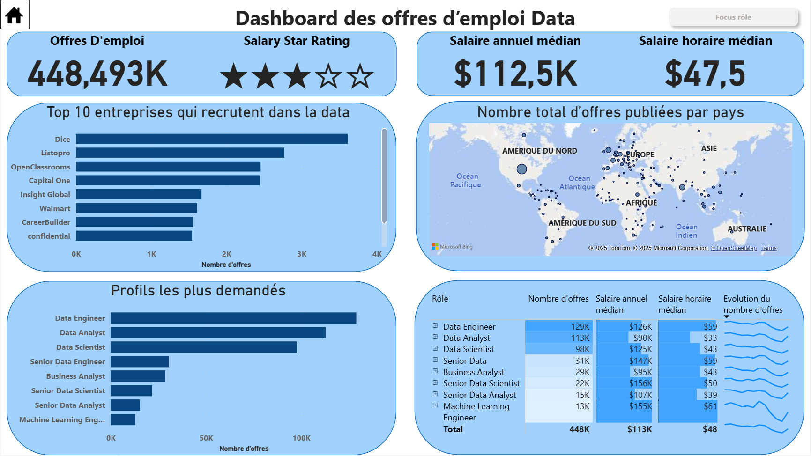
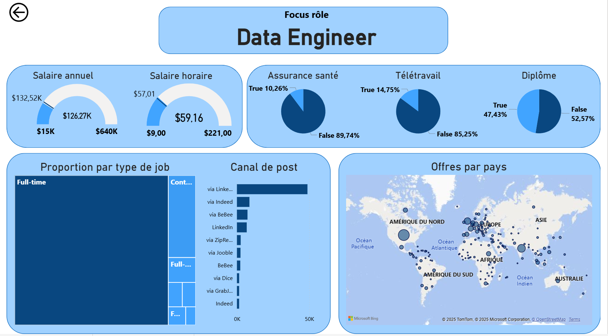
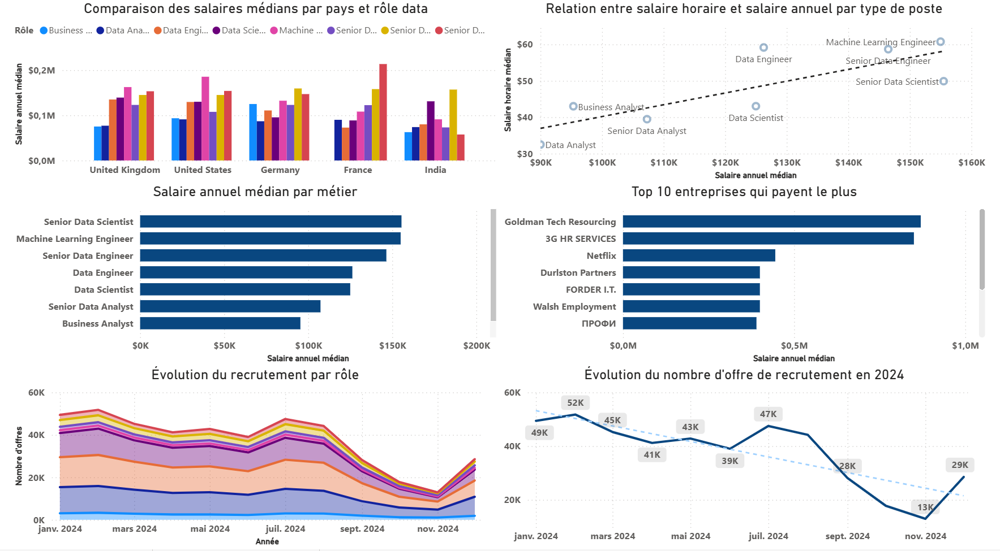
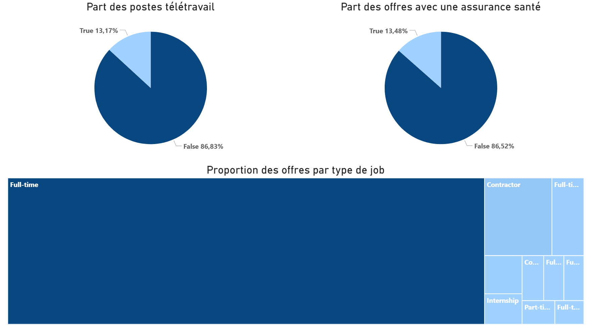

# Tableau de Bord des Métiers de la Data avec Power BI

---

## 🎯 Objectif

Ce projet a été conçu pour aider **les chercheurs d’emploi et les professionnels en reconversion** à mieux comprendre le marché de l’emploi dans la data.
Le problème ? Les informations (intitulés, salaires, compétences, pays) sont souvent éparpillées.
La solution ? Un **tableau de bord interactif et centralisé** qui permet d’analyser facilement :

* Les salaires médians par poste et par pays 🌍
* Les compétences demandées et leur poids dans le marché 🔑
* La répartition des types de contrats 💼
* Les opportunités en télétravail 🏡

---

## ⚙️ Workflow & Outils Utilisés

### 1. Prétraitement et Exploration (Google Colab)

* Nettoyage initial du dataset (offres d’emploi data 2024).
* Analyse exploratoire rapide avec **Plotly** (distributions, tendances, corrélations).
* Export des données nettoyées vers Power BI.

### 2. Transformation & Modélisation (Power Query + DAX)

* **Power Query :**

  * Normalisation des colonnes.
  * Gestion des valeurs manquantes.
  * Création de colonnes personnalisées (skills).
* **DAX :**

  * Mesures pour calculer la **Notation en étoiles**.

### 3. Visualisation & Dashboarding (Power BI)

* **Graphiques de base :** Barres, Colonnes, Nuages de points, courbes.
* **Cartes interactives :** répartition géographique des postes.
* **KPIs & Cartes :** résumé visuel des indicateurs principaux.
* **Navigation interactive :**

  * Drill-through pour explorer un rôle en détail.

---

## 🖼️ Structure du Dashboard

### Page 1 – Vue Globale du Marché

📌 KPIs principaux (nombre de postes, salaire médian, top 10 entreprises qui recrutent, profils les plus demandés).
📌 Carte de réprésentation des postes.
📌 Tableau de vue globale.

---

### Page 2 – Focus par rôle

📌 Salaires annuels et horaires (médiane).
📌 Part du télétravail, assurance santé, offre sans diplôme exigé.
📌 Répartition des contrats (Full-Time, Part-Time, Contractor).
📌 Carte des localisations.

---

### Page 3 – Salaires & métiers

📌 Comparaison des salaires médians par pays et rôle data.
📌 Relation entre salaire horaire et salaire annuel par type de poste.
📌 Salaire annuel médian par métier.
📌 Top 10 entreprises qui payent le plus.
📌 Évolution du recrutement par rôle.
📌 Évolution du nombre d'offre de recrutement en 2024.

---

### Page 4 – Compétences clés

📌 Compétences les plus demandées dans les offres.
📌 Analyse des types de compétences demandés par poste.
📌 Pourcentage d'offres par métier et mention diplôme.
📌 Carte offres par pays selon l’exigence de diplôme.

---

### Page 5 – Travail & avantages

📌 Part des postes télétravail.
📌 Part des offres avec une assurance santé.
📌 Proportion des offres par type de contrat.

---

## 🚀 Résultats Clés

* **SQL et Python** restent les incontournables.
* Les métiers de la data offrent une **large diversité de salaires** : certains analystes juniors commencent bas, mais des postes seniors/management explosent les plafonds 💰.
* Assez d'offres n'exigent pas un diplôme et le télétravail est présent aussi même si pas trop élevé.

---

## 🧑‍💻 Compétences Démontrées

* Prétraitement des données avec **Python (Pandas, Plotly)**.
* Transformation avancée avec **Power Query**.
* Création de **mesures DAX** pour KPIs.
* Conception d’un **tableau de bord Power BI interactif et ergonomique**.
* Data storytelling appliqué au marché de l’emploi dans la data.

---

## 📌 Conclusion

Ce projet illustre comment **un workflow hybride (Python + Power BI)** permet de passer :
➡️ des données brutes,
➡️ à une analyse exploratoire,
➡️ puis à un **dashboard clair, interactif et orienté décision**.

Les utilisateurs peuvent ainsi explorer le marché de l’emploi data et orienter leurs choix de carrière sur la base de **salaires, compétences et tendances réelles**.